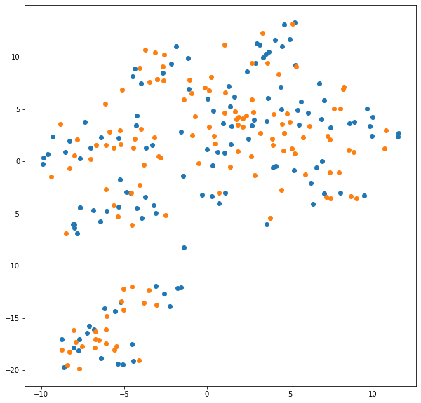

# 神经网络 作业二 实验报告

匡亚明学院 洪亮 181240019

## 声明

这次作业源码借鉴了李宏毅ML20的baseline以及DANN论文的[pytorch implementation](https://github.com/fungtion/DANN) 。

## 问题描述

给定真实图片和标签以及大量的手绘图片，设计一种方法使得模型可以预测出手绘图片的标签为何。让模型可以在训练时只需要 A dataset label，不需要 B dataset label 的情况下提高B dataset 的准确率。

训练集包含: 4500 张真实图片 + 标签, 32 x 32 ，测试集包含: 100000 张手绘图片，28 x 28 ，标签: 总共需要预测 9 个 class。

## 预处理

由于真实照片与手绘的线稿差别实在较大，故都压至黑白单通道图片。然后使用OpenCV进行边缘检测，辅以随机反转和<15度旋转增广制成目标训练集。

## 网络结构

* Feature Extractor：五层CNN，特征图扩展到512通道。

* Label Predictor：三层全连接层。

* Domain Classifier：五层全连接层。

* Gradient Reversal Layer：将loss取负并在DC模块前detach，合并入总loss，共享FE进行反向传播。

## 实验结果

## 可视化

### 使用DANN前

如下图，代码中将DC loss以及边缘检测注释掉即为训练代码。可见pca比起将九类分开，更倾向于将原数据集和测试集分开。

### 使用DANN后

为了让区别更明显一点，偷偷换成了tSNE。这九类效果巨好无比啊啊啊啊！

由于存在覆盖情况，再附上一张128+128点的图。可见的确很均匀如理论中所预设。

