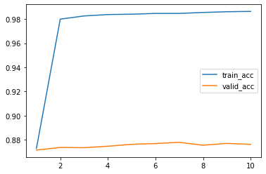
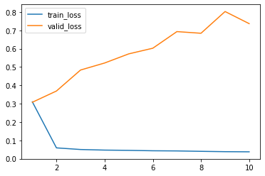
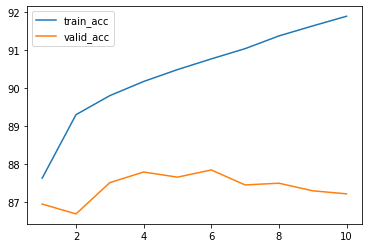
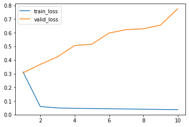

# 神经网络 期末作业一 实验报告

匡亚明学院 洪亮 181249918

## 声明

此次作业的训练框架参考了李宏毅ML20的baseline，bert直接使用了transformers包提供的预训练模型bert-base-chinese

## 任务一

* 实作self-training的LSTM，结果如下

  accuracy

  

  loss

  

  无self-training状态的LSTM即为epoch=1处的值。

* 实作bert，结果如下

  accuracy

  

  loss

  

## 任务二

（老师啊这个就当作是多做的那一个作业吧。。。实在调不动了）

这怎么调都没区别啊，加了东西性能还会差一点，nlp调参也不知道往哪里调。。。

目前对无label的标记是取threshold，>0.9/<0.1加入训练集。鄙人认为可以用lstm和bert两个网络预测的结果取相同的预测加入训练集。