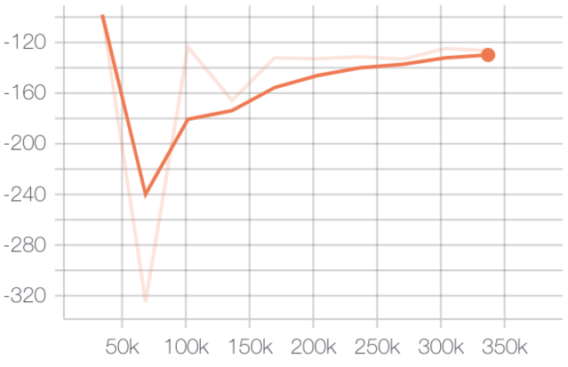
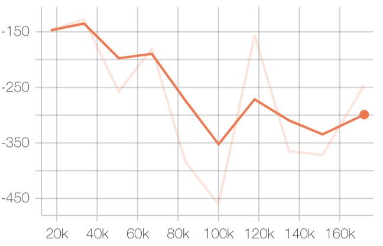
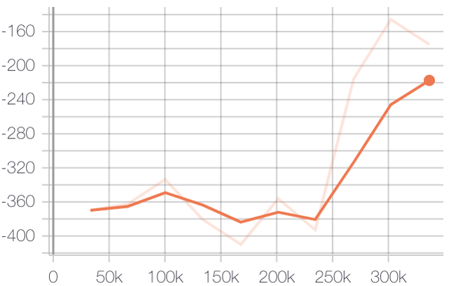
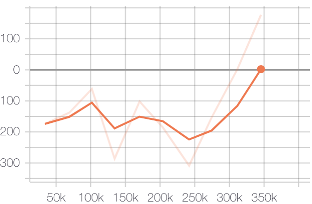

# 神经网络 期末作业二 实验报告

匡亚明学院 洪亮 181240019

## 声明

此次作业借用了tianshou平台进行调参，A2C实现借鉴了Github上A2C-pytorch的实现（毕竟他自己代码是跑不通的。。。）tianshou的log使用tensor board进行可视化。

## 任务一

范例已跑通。结果惨淡。下为baseline使用tianshou实现并调参的reward（见pg-mod.py）

baseline with batchsize 64, gamma 0.95, net [128,128,128,128]

mod with batchsize 32, gamma 0.95, net [128,128,128,128]

mod with batchsize 64, gamma 0.90, net [128,128,128,128]

mod with batchsize 64, gamma 0.95, net [128,256,128]

可见batch size 越大越好，网络越宽越好。

关于改进reward计算方式我没明白是啥意思，在 pg-re.py里改了一下也不知道对不对。。。反正结果是更糟了。

## 任务二

实作了A2C，由于没有再搞并行化采样，运行速度较tianshou慢不少。因为网络很浅，所以改用cpu跑省去内存拷贝可能速度跟gpu也差不多。。。一共跑了九个小时，这是缩短不了的，为助教默哀。。。训练log参见 njunn-fin-rl.log

可见在11500ep时reward为247.988超过200，即成功。

每局操作次数呈先升后降趋势，可理解为先用最大操作步数让着陆器先着陆成功，再减少喷气次数进一步提高reward。

## 任务三

又多试了一下DQN（见dqn.py），发现DQN成功的速度快很多。虽然比较原始，但是对于这种简单的任务可能更加有效。