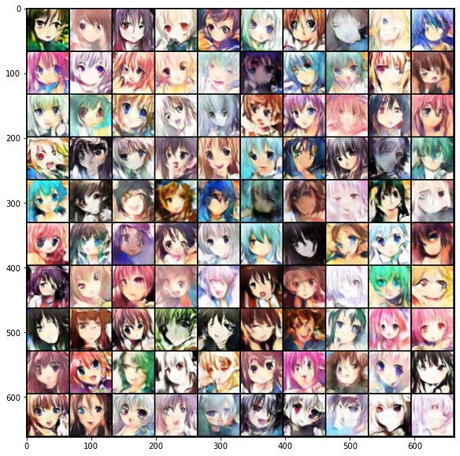
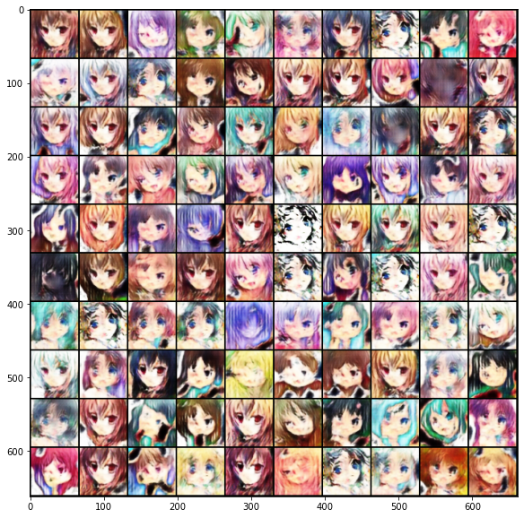
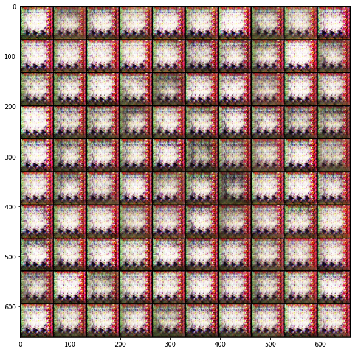

# 神经网络 期末作业三 实验报告

匡亚明学院 洪亮 181240019

## 声明

作业中使用了李宏毅ML20的baseline，并参照了wgan-pytorch的实现。

## 任务一

### 网络结构

Generator

```
----------------------------------------------------
      Layer (type)        Output Shape      Param #
====================================================
          Linear-1          [-1, 8192]      819,200
     BatchNorm1d-2          [-1, 8192]       16,384
            ReLU-3          [-1, 8192]            0
 ConvTranspose2d-4     [-1, 256, 8, 8]    3,276,800
     BatchNorm2d-5     [-1, 256, 8, 8]          512
            ReLU-6     [-1, 256, 8, 8]            0
 ConvTranspose2d-7   [-1, 128, 16, 16]      819,200
     BatchNorm2d-8   [-1, 128, 16, 16]          256
            ReLU-9   [-1, 128, 16, 16]            0
ConvTranspose2d-10    [-1, 64, 32, 32]      204,800
    BatchNorm2d-11    [-1, 64, 32, 32]          128
           ReLU-12    [-1, 64, 32, 32]            0
ConvTranspose2d-13     [-1, 3, 64, 64]        4,803
           Tanh-14     [-1, 3, 64, 64]            0
====================================================
Total params: 5,142,083
Trainable params: 5,142,083
Non-trainable params: 0
----------------------------------------------------
Input size (MB): 0.00
Forward/backward pass size (MB): 3.00
Params size (MB): 19.62
Estimated Total Size (MB): 22.62
----------------------------------------------------
```

Discriminator

```
----------------------------------------------------
    Layer (type)         Output Shape       Param #
====================================================
        Conv2d-1     [-1, 64, 32, 32]         4,864
     LeakyReLU-2     [-1, 64, 32, 32]             0
        Conv2d-3    [-1, 128, 16, 16]       204,928
   BatchNorm2d-4    [-1, 128, 16, 16]           256
     LeakyReLU-5    [-1, 128, 16, 16]             0
        Conv2d-6      [-1, 256, 8, 8]       819,456
   BatchNorm2d-7      [-1, 256, 8, 8]           512
     LeakyReLU-8      [-1, 256, 8, 8]             0
        Conv2d-9      [-1, 512, 4, 4]     3,277,312
  BatchNorm2d-10      [-1, 512, 4, 4]         1,024
    LeakyReLU-11      [-1, 512, 4, 4]             0
       Conv2d-12        [-1, 1, 1, 1]         8,193
      Sigmoid-13        [-1, 1, 1, 1]             0
====================================================
Total params: 4,316,545
Trainable params: 4,316,545
Non-trainable params: 0
----------------------------------------------------
Input size (MB): 0.05
Forward/backward pass size (MB): 2.31
Params size (MB): 16.47
Estimated Total Size (MB): 18.83
----------------------------------------------------
```

### 超参数

batch size = 64, epoch = 51, optimizer = Adam(lr=1e-4, betas=(0.5,0.999))

### 结果




## 任务二

### 网络结构

Generator

```
----------------------------------------------------
      Layer (type)        Output Shape      Param #
====================================================
          Linear-1          [-1, 6400]      646,400
     BatchNorm2d-2     [-1, 256, 5, 5]          512
            ReLU-3     [-1, 256, 5, 5]            0
 ConvTranspose2d-4     [-1, 256, 9, 9]      590,080
     BatchNorm2d-5     [-1, 256, 9, 9]          512
            ReLU-6     [-1, 256, 9, 9]            0
 ConvTranspose2d-7     [-1, 256, 9, 9]      590,080
     BatchNorm2d-8     [-1, 256, 9, 9]          512
            ReLU-9     [-1, 256, 9, 9]            0
ConvTranspose2d-10   [-1, 256, 17, 17]      590,080
    BatchNorm2d-11   [-1, 256, 17, 17]          512
           ReLU-12   [-1, 256, 17, 17]            0
ConvTranspose2d-13   [-1, 256, 17, 17]      590,080
    BatchNorm2d-14   [-1, 256, 17, 17]          512
           ReLU-15   [-1, 256, 17, 17]            0
ConvTranspose2d-16   [-1, 128, 33, 33]      295,040
    BatchNorm2d-17   [-1, 128, 33, 33]          256
           ReLU-18   [-1, 128, 33, 33]            0
ConvTranspose2d-19    [-1, 64, 64, 64]       73,792
    BatchNorm2d-20    [-1, 64, 64, 64]          128
           ReLU-21    [-1, 64, 64, 64]            0
ConvTranspose2d-22     [-1, 3, 64, 64]        1,731
           Tanh-23     [-1, 3, 64, 64]            0
====================================================
Total params: 3,380,227
Trainable params: 3,380,227
Non-trainable params: 0
----------------------------------------------------
Input size (MB): 0.00
Forward/backward pass size (MB): 13.86
Params size (MB): 12.89
Estimated Total Size (MB): 26.76
----------------------------------------------------
```

Discriminator

```
----------------------------------------------------
    Layer (type)         Output Shape       Param #
====================================================
        Conv2d-1     [-1, 64, 32, 32]         4,864
     LeakyReLU-2     [-1, 64, 32, 32]             0
        Conv2d-3    [-1, 128, 16, 16]       204,928
   BatchNorm2d-4    [-1, 128, 16, 16]           256
     LeakyReLU-5    [-1, 128, 16, 16]             0
     Dropout2d-6    [-1, 128, 16, 16]             0
        Conv2d-7      [-1, 256, 8, 8]       819,456
   BatchNorm2d-8      [-1, 256, 8, 8]           512
     LeakyReLU-9      [-1, 256, 8, 8]             0
    Dropout2d-10      [-1, 256, 8, 8]             0
       Conv2d-11      [-1, 512, 4, 4]     3,277,312
  BatchNorm2d-12      [-1, 512, 4, 4]         1,024
    LeakyReLU-13      [-1, 512, 4, 4]             0
    Dropout2d-14      [-1, 512, 4, 4]             0
       Linear-15              [-1, 1]         8,193
====================================================
Total params: 4,316,545
Trainable params: 4,316,545
Non-trainable params: 0
----------------------------------------------------
Input size (MB): 0.05
Forward/backward pass size (MB): 2.75
Params size (MB): 16.47
Estimated Total Size (MB): 19.26
----------------------------------------------------
```

### 超参数

batch size = 32, epoch = 51, optimizer = SGD(lr=1e-4)

### 结果



## 总结

由图可见，DCGAN并未取得较baseline(WGAN)更好的结果，但是baseline训练极为不稳定，甚至出现如下图所示的状况，此为任务一中所展示图的下一个epoch的结果。

由于计算负载较高，所以WGAN将batch折半为32，相比baseline，WGAN一切设定从简，例如去掉了所有sigmoid，将Adam换回SGD，但结果上的确增加了稳定性。鄙人认为DCGAN在51epoch后还能有较大提升。

